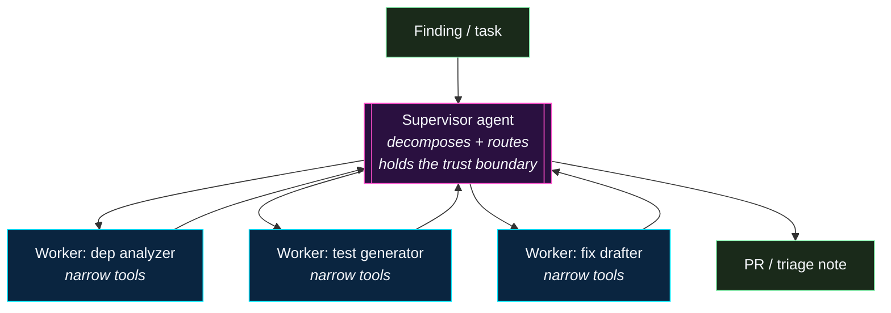
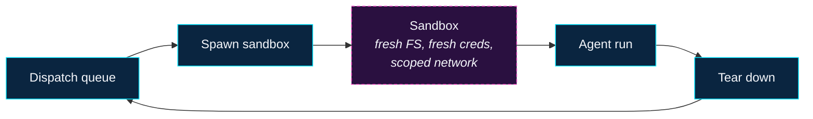
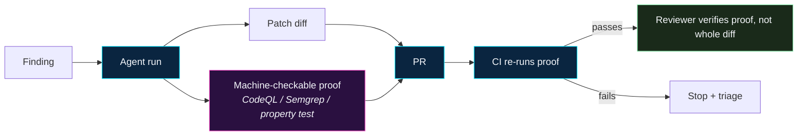


**Moving target.** The patterns on this page are *emerging*, not
settled. Each entry is worth tracking; not every entry will turn
out to be load-bearing. Treat this page as a read-before-you-adopt
scan, not a shopping list.


The reference workflows on this site cover the baseline:
bounded-scope agents behind a reviewer, running deterministic
verification, opening PRs rather than merges. Beyond that
baseline, the broader community is actively experimenting with
patterns and tooling that meaningfully change the cost / benefit
math on agentic remediation.

This page catalogs the ones we think are worth following. For
each: what it is, why it matters, and what to watch for before
betting on it in a production program.

---

## Triage and prioritization

### Reachability-aware CVE prioritization

- **What it is.** Using call-graph / static analysis to decide
  whether a CVE in a dependency is **actually reachable** from
  the service's entry points before opening a remediation task.
  The underlying insight: most CVEs in a typical dependency tree
  are not in code your service ever executes.
- **Why it matters.** Reachability filtering collapses the CVE
  queue by an order of magnitude in most codebases, which makes
  the remaining queue small enough to actually remediate —
  whether by an agent or a human. It also flips the default
  behaviour of an agent from "bump everything" to "bump the
  reachable ones first."
- **Watch for.** False negatives (reachability analysis can miss
  dynamic dispatch, reflection, or framework-mediated calls).
  Unreachable-today can become reachable-tomorrow, so the
  analysis has to re-run on every PR, not just at intake.
- **Representative tooling.** Endor Labs, Semgrep Supply Chain,
  Socket.dev, Snyk Reachability, JFrog Xray. The technique is
  also available in open-source form via `govulncheck` (Go) and
  similar language-specific tools.

### AI-assisted SAST triage

- **What it is.** AI-assisted review of SAST findings that
  decides whether a reported finding is a real issue or a false
  positive, and optionally drafts a fix. The agent sits *after*
  the deterministic scanner, not in place of it.
- **Why it matters.** SAST false-positive rates are the single
  biggest reason SAST programs stall out. AI-assisted triage
  flips the economics — the scanner is still the source of
  truth, but reviewer time goes to the findings the assistant
  couldn't resolve on its own.
- **Watch for.** The assistant accepting bad findings (false
  negatives) is worse than the scanner producing false
  positives. Keep a hold-out set of known-true findings and
  regression against it weekly.
- **Representative tooling.** Semgrep Assistant, Snyk DeepCode
  AI, GitHub Advanced Security's code-scanning autofix,
  SonarQube AI CodeFix.

### Supply-chain reputation scoring

- **What it is.** Per-package reputation signals (maintainer
  churn, typo-squat proximity, capability-manifest drift,
  unusual network / filesystem calls) surfaced alongside
  version metadata at install time. The agent's dispatch layer
  uses the score as an eligibility gate — "can we auto-bump this
  package?" is a function of reputation, not just of CVE
  severity.
- **Watch for.** Scoring is opaque by default. If you integrate
  a reputation feed, require evidence for any score that gates
  behaviour, and keep an override path.
- **Representative tooling.** Socket.dev, Phylum, Snyk, GitHub
  dependency review — plus the OpenSSF Scorecard project for an
  open-source signal bundle.

---

## Orchestration

### Supervisor / worker multi-agent patterns

- **What it is.** Instead of one large agent doing everything,
  a **supervisor** agent decomposes the task into subtasks and
  dispatches them to specialized **worker** agents (e.g., one
  for dependency analysis, one for test generation, one for
  fix drafting). The supervisor holds the trust boundary; the
  workers are narrower and cheaper to sandbox.
- **Why it matters.** Narrower agents are easier to evaluate,
  easier to guardrail, and cheaper to run. The pattern aligns
  neatly with the reviewer-gated, bounded-scope philosophy
  elsewhere on this site.
- **Watch for.** Orchestration complexity compounds fast.
  Start with a two-agent (supervisor + one worker) split before
  adding more.
- **Representative tooling.** LangGraph, CrewAI, AutoGen
  (Microsoft), OpenAI Swarm (experimental), and the
  orchestrator primitives inside each of the five per-tool
  agent platforms on this site.

### Planner / executor separation

- **What it is.** A close relative of supervisor / worker: the
  **planner** produces a stepwise plan as structured text; a
  separate **executor** runs each step with tightly scoped tool
  access. A human (or a verifier agent) can approve the plan
  before execution begins.
- **Why it matters.** Plan review is a natural checkpoint —
  cheaper to catch "the agent is about to do the wrong thing"
  at plan-time than at execution-time.
- **Watch for.** If the executor can't deviate from the plan
  when it's obviously wrong, you're trading safety for
  brittleness. The pattern works when plans are coarse-grained
  and the executor has explicit fall-back-to-ask behaviour.

### Chain-of-verification

- **What it is.** The agent generates an answer, then generates
  a set of verification questions about its own answer, then
  answers those questions with fresh context, and revises. The
  technique is originally from question-answering research
  (Dhuliawala et al.) but has become a common building block in
  agent prompts.
- **Why it matters.** It's a cheap way to catch confabulated
  facts (made-up file paths, non-existent function names) before
  the agent commits them to a PR.
- **Watch for.** It doubles token cost. Worth it on high-stakes
  steps (the final PR body, the proposed patch); overkill on
  every intermediate reasoning step.

---

## Sandbox and execution runtimes

### Ephemeral, per-run sandboxes

- **What it is.** Instead of running agents inside a
  long-lived container, each run gets a fresh, ephemeral
  execution environment — a VM, micro-VM, or container created
  at dispatch and torn down at completion. Filesystem, network,
  credentials, and process state are all fresh.
- **Why it matters.** Blast radius of a compromised or runaway
  agent is bounded by the lifespan of the sandbox. Persistent
  exploitation becomes much harder.
- **Watch for.** Cold-start latency. For high-throughput
  queues, you need a warm pool or a very fast boot path.
- **Representative tooling.** e2b, Daytona, Modal, Morph Labs,
  Firecracker micro-VMs (AWS Lambda's substrate), gVisor.

### Browser sandboxes for agents with web access

- **What it is.** Agents that need web access run inside a
  heavily instrumented browser (Playwright, Puppeteer, or a
  custom agent browser) with DOM-level policy — not inside the
  host browser.
- **Why it matters.** A browser is the highest-risk tool an
  agent can hold: every page is a potential prompt-injection
  payload. Isolating it behind a sandboxed browser with a
  per-run profile makes it safer.
- **Representative tooling.** Browserbase, Playwright-based
  agent harnesses, Anthropic's Claude-in-Chrome and similar
  vendor offerings.

### Policy-as-code for agent tool calls

- **What it is.** Policy engines (OPA / Cedar / custom) sit
  between the agent and its tools. Every tool call is
  policy-checked before it fires: "is this agent allowed to
  write to `db/migrations/*.sql`?", "is the target URL on the
  allowlist?", "has the daily token budget been exceeded?".
- **Why it matters.** Moves guardrails from prose in the prompt
  (where the agent can talk itself out of them) to enforced
  policy (where it can't). Policy is also auditable and
  reviewable separately from prompt changes.
- **Representative tooling.** Open Policy Agent (OPA), Cedar,
  Kyverno (for Kubernetes-scoped agents), custom ingress
  policies on MCP gateways. See also the
  [MCP Gateways]() writeup.

---

## Guardrail and safety frameworks

### NeMo Guardrails (NVIDIA)

- **What it is.** A Python framework for adding input
  validation, output validation, topic constraints, and
  dialogue-flow constraints around an LLM. Guardrails are
  specified in Colang, a small domain-specific language.
- **Why it matters.** Gives you a place to put constraints that
  doesn't depend on prompt discipline alone. Works well in
  front of a model API call or wrapped around a tool invocation.
- **Where.** `github.com/NVIDIA/NeMo-Guardrails`.

### Guardrails AI

- **What it is.** A Python library that validates LLM
  outputs against schemas and policies, and can repair or
  reject outputs that violate them. Ships with a hub of
  reusable validators.
- **Why it matters.** Schema validation on agent output (PR
  body shape, structured triage note shape, policy
  conformance) is one of the cheapest-to-operate controls a
  program can add. Guardrails AI makes it a library call.
- **Where.** `github.com/guardrails-ai/guardrails`.

### LLM Guard (Protect AI)

- **What it is.** An open-source toolkit of input and output
  scanners (prompt-injection detection, PII redaction, bias,
  toxicity, secrets) packaged as a pluggable pipeline.
- **Where.** `github.com/protectai/llm-guard`.

### Provider-native safety layers

- Most major providers publish moderation / safety endpoints
  (OpenAI Moderation, Anthropic Claude's constitutional
  responses, Google's Responsible AI filters). Treat these as
  defence-in-depth, not primary controls.

---

## Verification and provenance

### Proof-carrying patches

- **What it is.** The agent's output is not just a diff — it's a
  diff **plus a machine-checkable artifact** (a CodeQL query
  result, a Semgrep rule match, a passing property test) that
  proves the diff resolves the original finding. The reviewer
  checks the proof, not the whole diff.
- **Why it matters.** Reviewer time is the rate-limiting step
  in almost every remediation program. Anything that turns
  review into "verify the proof" instead of "re-understand the
  entire diff" compounds.
- **Watch for.** The proof has to be cheap to re-run and hard to
  forge. Store the proof next to the diff in the PR; re-run it
  in CI.
- **Representative shapes.** CodeQL queries attached as
  SARIF to the PR; Semgrep rules run with `--baseline-ref`;
  property tests asserting the old failure mode is gone.

### SLSA provenance for agent-produced PRs

- **What it is.** Cryptographic provenance on the build
  artifacts produced from an agent-authored PR — what source
  produced this binary, on what runner, invoked by whom. SLSA
  (Supply-chain Levels for Software Artifacts) formalises the
  requirements.
- **Why it matters.** Provides an audit trail for "who
  authored this code, and what actually ran in CI". Useful when
  compliance asks "how do we know a human approved this
  change?" — the SLSA statement can record the reviewer.
- **Where.** `slsa.dev`. Tooling: `cosign`, `witness`, and
  in-toto attestations.

### Sigstore / cosign for signed commits and attestations

- **What it is.** Keyless signing (OIDC-bound) for git commits
  and build attestations. The agent's commits are signed with a
  workload identity that can be distinguished from human
  commits at audit time.
- **Why it matters.** Fingerprinting agent-authored commits is
  a small, concrete step toward compliance-grade traceability.
- **Where.** `sigstore.dev`.

### Reproducible builds for agent outputs

- **What it is.** If an agent's output is a built artifact
  (a generated config, compiled binary, synthetic test corpus),
  making the build reproducible means the reviewer can
  verify by rebuild. Combine with SLSA provenance for a full
  "who built this, and can I re-derive it" story.

---

## Observability for agents

### Agent-specific tracing and eval platforms

- **What it is.** Purpose-built observability for LLM and
  agent workloads: per-run traces of every model call, tool
  call, prompt, and response, with eval scores attached.
- **Why it matters.** Reviewing agent behaviour without
  traces is guesswork. Traces are what turn "the agent
  produced a weird PR" from a vibe into a debuggable event.
- **Representative tooling.** LangFuse (open source), Helicone
  (open source), LangSmith (LangChain), Arize Phoenix, W&B
  Weave, Braintrust, Datadog LLM Observability.

### Prompt regression testing

- **What it is.** A versioned suite of inputs + expected-shape
  outputs (or eval-scored outputs) that runs on every prompt
  change and every model bump. Think "unit tests for prompts."
- **Why it matters.** Without regression tests, you will find
  out about prompt regressions when reviewers start bouncing
  PRs. With them, you find out in CI.
- **Representative tooling.** Promptfoo, DeepEval, LangSmith
  evals, Braintrust, OpenAI Evals. See also
  [Reputable Prompt Sources]().

### Drift detection

- **What it is.** Metrics + alerts for behavioural drift: merge
  rate, review turnaround, false-positive rate, tool-call
  distribution, per-prompt cost. A change in the underlying
  distribution is usually the first sign of a model change, a
  prompt regression, or a changed input distribution.
- **Why it matters.** Models get updated silently by vendors.
  Prompts shift under you. Drift detection is how you notice.
- **Cross-link.** See
  [Program Metrics & KPIs]()
  for what to measure.

---

## Container and image security

### Golden images and base-image hygiene

- **What it is.** A centrally owned set of pre-hardened base
  container images that every team starts from. Scanned,
  signed, SBOM-embedded, and rebuilt on a known cadence — see
  [Automation → Golden images]()
  for the full treatment.
- **Why it matters here.** Golden images turn container-image
  scanning from "every team triages the same base-layer CVEs
  independently" into "platform rebuilds once, every team picks
  up the fix on the next deploy." That shape pairs directly
  with the
  [Vulnerable Dependency Remediation]()
  workflow — with golden images, the agent's PR is almost
  always a single-line `FROM` bump.

### Capability-scoped container runtimes

- **What it is.** Runtimes that enforce seccomp, AppArmor /
  SELinux, and capability drops by default — often as a
  required admission policy. Agents running inside such a
  sandbox can't easily escape even if their prompt is
  compromised.
- **Representative tooling.** gVisor, Kata Containers,
  Firecracker, and admission controllers like OPA Gatekeeper
  or Kyverno enforcing the `restricted` Kubernetes PSS profile.

---

## Coding standards evolving under agents

### `AGENTS.md` as a shared convention

- **What it is.** `AGENTS.md` started with Codex but has become
  a widely adopted convention for repo-level instructions to
  coding agents — regardless of vendor. Several tools
  (Codex, Cursor, Claude, and others) now read it.
- **Why it matters.** One file, many agents. If your repo
  already has tool-specific files (`CLAUDE.md`,
  `copilot-instructions.md`, `.cursor/rules/*.mdc`), the
  duplication is a maintenance problem that `AGENTS.md` is
  trying to solve.
- **Watch for.** Tools adopt the convention at different rates
  and with different precedence rules. Keep tool-specific files
  for now, link out to a shared `AGENTS.md` for the parts that
  genuinely overlap.

### Agent-readable CODEOWNERS extensions

- **What it is.** Extending `CODEOWNERS` (or a similar file)
  to carry additional metadata that agents can read: blast
  radius, review requirements, forbidden paths, required
  reviewers by finding class.
- **Why it matters.** Dispatch decisions ("is this PR
  auto-mergeable?" / "who needs to review?") become
  data-driven rather than prompt-embedded.

### Commit conventions for agent traceability

- **What it is.** Structured trailers on agent-authored commits
  (`Co-Authored-By:`, `Agent-Model:`, `Agent-Run-Id:`,
  `Prompt-Hash:`) that the orchestrator writes automatically.
- **Why it matters.** One-command answers to "which commits
  were agent-authored?" and "which prompt version produced
  this commit?" — both are routine compliance questions.

---

## How to track what's next

- **Pick three sources and follow them.** The MITRE ATLAS
  updates, the OWASP GenAI Project release notes, and the
  per-vendor changelogs for the agent platforms your program
  uses are a reasonable minimum. Add the
  [reputable prompt sources]() list as a quarterly skim.
- **Run a "what's new?" review quarterly.** Pick the top three
  items that have emerged since the last review, decide whether
  any are worth piloting, and retire any entries here that
  clearly didn't pan out.
- **Contribute back.** Anything you find that earns its keep,
  [contribute back]() — either as
  a new entry on this page, or as a full workflow page.

## See also

- [Fundamentals]() — the settled primer
- [Threat Model]() — agents as attack surface
- [Prompt Library → Sources]() — where to find pre-engineered prompts
- [Automation]() — deterministic tools that underpin all of the above
- [Security Remediation → Rollout & Maturity]() — where these patterns fit on the adoption curve
