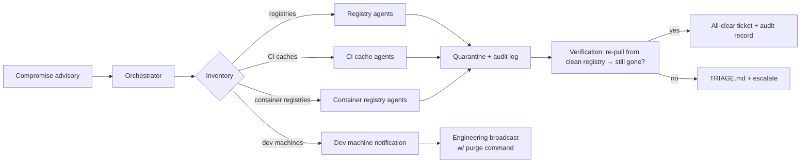
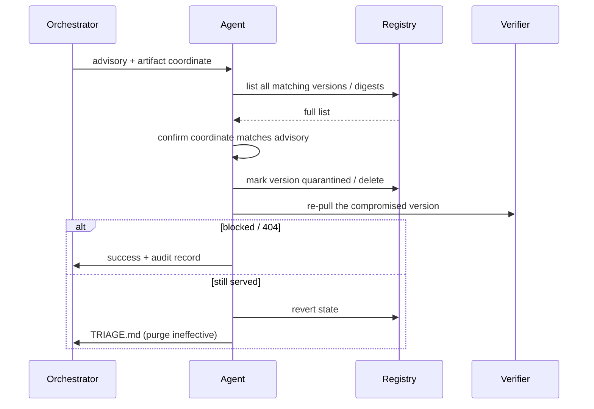


**Scope.** This is the workflow that runs **alongside** dependency
or base-image remediation when an advisory says the artifact
itself is compromised — maintainer account takeover, poisoned
release, supply-chain worm. Routine version bumps don't trigger
this workflow; the lockfile bump is sufficient.


## What problem this solves

A typical "vulnerable dependency" workflow assumes the upstream
package is safe and only an old version is buggy. Bump forward,
ship, done. Compromised-package advisories invert that assumption:
the package itself is the threat, and the artifact has often been
**copied, mirrored, and cached** across half the org's
infrastructure before the advisory fires.

The places a compromised artifact can hide are the same ones it
can hide in any infrastructure built for speed:

- **Internal proxy registries.** Artifactory, Nexus, GitHub
  Packages, Verdaccio, the org's pull-through cache for npm /
  PyPI / Maven Central / RubyGems / crates.io / Hex.
- **Container registries.** ECR, GCR, GAR, Harbor, Docker Hub
  mirrors — the registry where every derived image's base layer
  lives.
- **CI build caches.** GitHub Actions cache, GitLab cache,
  Buildkite agents, Jenkins workspaces, ccache / sccache, npm /
  pnpm / yarn / pip wheel caches, Go module proxies.
- **Developer machines.** `~/.npm`, `~/.cache/pip`, `~/go/pkg/mod`,
  `~/.gradle/caches`, `~/.m2`, the developer's local
  Docker / Podman image store.
- **Artifact promotion paths.** Anywhere a built artifact is
  signed and promoted forward — the promoted-but-not-yet-deployed
  bucket is exactly where a compromised artifact can sit dormant.

Bumping the lockfile evicts the compromised version from
*future* installs. It does not evict the version that is already
sitting in seventy build caches and a hundred laptops. This
workflow targets the eviction.

## High-level flow

## Why agents fit this workflow

The work is mechanical, repetitive, has a tight verification
step, and touches infrastructure where a single misstep ("purged
the wrong package") has a wide blast radius. Concretely:

- **Mechanical.** Each registry exposes a deletion API; the
  command shape is "find the artifact by name + version, mark it
  forbidden, confirm it can no longer be served."
- **Bounded.** The agent is told exactly which artifact to
  evict. It does not get a free hand on the registry.
- **Verifiable.** After purging, the registry re-serves a
  request for the compromised version and the agent confirms a
  404 or a quarantine response. If the artifact is still
  reachable, the agent stops.
- **Auditable.** Every deletion is a logged API call, signed
  with the agent's identity, with the advisory ID and the
  verification result attached.

Where it doesn't fit: dev machines. Agents don't reach into
laptops. Dev-machine eviction is a *broadcast* to engineering
with a paste-ready purge command — which the agent drafts but a
human delivers.

## What 'eligible' means

The classifier hands a finding to the agent only when:

- The advisory is **labelled compromise / malicious**, not
  "vulnerable." Routine CVEs go through the lockfile workflow.
- The artifact is identifiable by a **stable coordinate** —
  `name@version` for package registries, `image:tag` or
  `image@digest` for container registries. Range-based or
  fuzzy identifiers go to triage.
- The org has declared the registry as **agent-quarantine
  capable** in the program's policy — meaning the registry has
  an API for marking a version forbidden, the agent has a
  scoped credential for that API, and the registry's clients
  honour the quarantine state.
- The blast radius of an over-eviction is bounded — the
  registry can be **restored from upstream** in minutes if the
  agent purges the wrong version (private packages with no
  upstream are not eligible; humans handle those).

Anything else routes to triage.

## What the agent does

Per registry kind, the agent's actions are different but the
shape is identical:

### Per-registry-kind notes

- **Package proxy registries (npm / PyPI / Maven / etc.).** The
  preferred state is **quarantine, not delete** — quarantine
  preserves the artifact for forensic re-fetch and audit, while
  blocking new pulls. Hard delete only when policy explicitly
  requires it (regulatory, contractual). Quarantining the
  upstream-cache copy of a public package does not delete it
  upstream — the goal is to break the org's ability to *re-fetch*
  it, not to censor the public registry.
- **Container registries.** Container image digests are
  immutable; the agent quarantines the **tag** (so resolution
  fails) and adds an explicit deny on the digest. Some registries
  support image-signing-policy bumps that achieve the same; use
  whichever leaves the cleanest audit trail.
- **CI build caches.** Caches are typically keyed on a hash of
  inputs; the agent invalidates the cache **key** rather than
  deleting individual entries, so the next build refetches from
  the (now-quarantined) registry. Where a CI provider supports
  a TTL-based purge, prefer that.
- **Pull-through proxies.** A pull-through proxy that stores the
  upstream artifact locally needs the local copy invalidated.
  Mark the upstream coordinate as a deny rule; verify by pointing
  a test client at the proxy.
- **Mirrored OCI registries / Helm chart museums.** Treat the
  same way as container registries; the chart's digest is the
  primary key.

### Dev-machine broadcast (not auto-purged)

The agent does **not** SSH into developer laptops. Instead, the
agent drafts a broadcast for engineering with:

- The exact purge command per package manager (`npm cache
  clean`, `pip cache remove`, `go clean -modcache -i <pkg>`,
  `docker rmi`, `pnpm store prune`, `yarn cache clean`, etc.).
- The list of cache locations to delete by hand if the package
  manager doesn't expose a per-package purge.
- A "verify clean" command that confirms eviction worked.

The engineering team owns the broadcast distribution. The agent's
audit record tracks the broadcast was sent, not that any laptop
acknowledged it — that is by design.

## Guardrails

- **Quarantine before delete.** Default action is reversible
  quarantine. Hard delete requires an extra approval step
  (security director or named role) and is not in the agent's
  default toolset.
- **Per-registry credentials, scoped to the registry.** The agent
  has one credential per registry, scoped to "manage version
  state on packages matching the advisory's namespace." It cannot
  publish, cannot delete unrelated packages, cannot rotate
  upstream URLs.
- **Coordinate match required.** The agent will not act on a
  fuzzy match. If the advisory says
  `evil-pkg@1.2.3,1.2.4,1.2.5` and the registry only has
  `1.2.3`, the agent purges `1.2.3` and notes the others as
  "not present in this registry" — it does not preemptively
  block a future `1.2.4`.
- **Verification before audit-success.** The agent re-fetches
  the purged artifact and confirms the registry now refuses to
  serve it. No verification, no success record.
- **Restore path documented.** Every purge action's audit record
  includes the command to *restore* the artifact (e.g., re-cache
  from upstream) so the action is reversible by a human if the
  advisory turns out to be wrong.
- **Rollback policy on advisory withdrawal.** If the advisory is
  later withdrawn (false positive at the source), the agent
  has a separate workflow that **reverses** the quarantine and
  records the reversal. Compromise advisories get retracted; the
  cache state has to follow.
- **Out-of-band notification.** Every quarantine action posts to
  the security incident channel in real time. Quiet purges are
  the wrong default — operators need to know the cache state
  changed.

## What it won't catch

- **Out-of-cache copies.** A binary that was already extracted
  into a deployed container, baked into an AMI, or vendored into
  a downstream repo is out of scope. Those are separate
  remediations (image rebuild, vendored-source bump).
- **Compromise that doesn't change the version coordinate.** If
  an attacker replaced a published version's tarball without
  bumping the version (rare on locked-immutable registries,
  possible on misconfigured ones), the digest-versus-version
  divergence is the signal — but reconciling it is out of scope
  for this agent. Triage.
- **Dev-machine state.** Laptops are notification, not action.
- **Air-gapped mirrors.** Mirrors the agent has no network path
  to are out of scope; the broadcast pattern applies.
- **Build artifacts already in production.** A purged source does
  not retroactively un-deploy a service that was built from it.
  See [Vulnerable Dependency Remediation]()
  for the malicious-package downgrade path that pairs with this
  one.

## How this workflow evolves

- **Registry connectors.** New registries plug in as MCP
  connectors with a stable verb set: `list-versions`,
  `mark-quarantine`, `verify-blocked`, `restore`. The agent
  doesn't need to know which registry product is on the other
  end of the connector.
- **Coordinate normalisation.** Cross-ecosystem coordinate
  parsers (PURL, Sigstore-style) are a natural place to invest
  as the workflow scales beyond a few registries.
- **Detection upstream.** The faster the advisory feed, the
  smaller the in-cache window. Pair this workflow with a
  reputation feed and a typosquat scanner; both shorten the
  window.

## See also

- [Vulnerable Dependency Remediation → Malicious-package
  downgrade path]()
  — the lockfile-shaped sibling.
- [Base Image & Container Layer Remediation]()
  — when the compromised artifact is a base image.
- [Threat Model → Agent-infrastructure supply-chain compromise]()
  — why this case is treated separately from routine CVEs.
- [Reviewer Playbook]()
  — what a reviewer looks for in a quarantine action's audit
  record.

## Changelog

- 2026-04-25 — v1 reference workflow. Quarantine-by-default for
  package proxies and container registries; CI cache invalidation
  via key bump; dev-machine broadcasts drafted but human-delivered.
