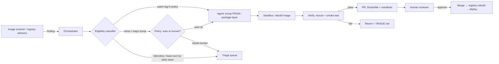
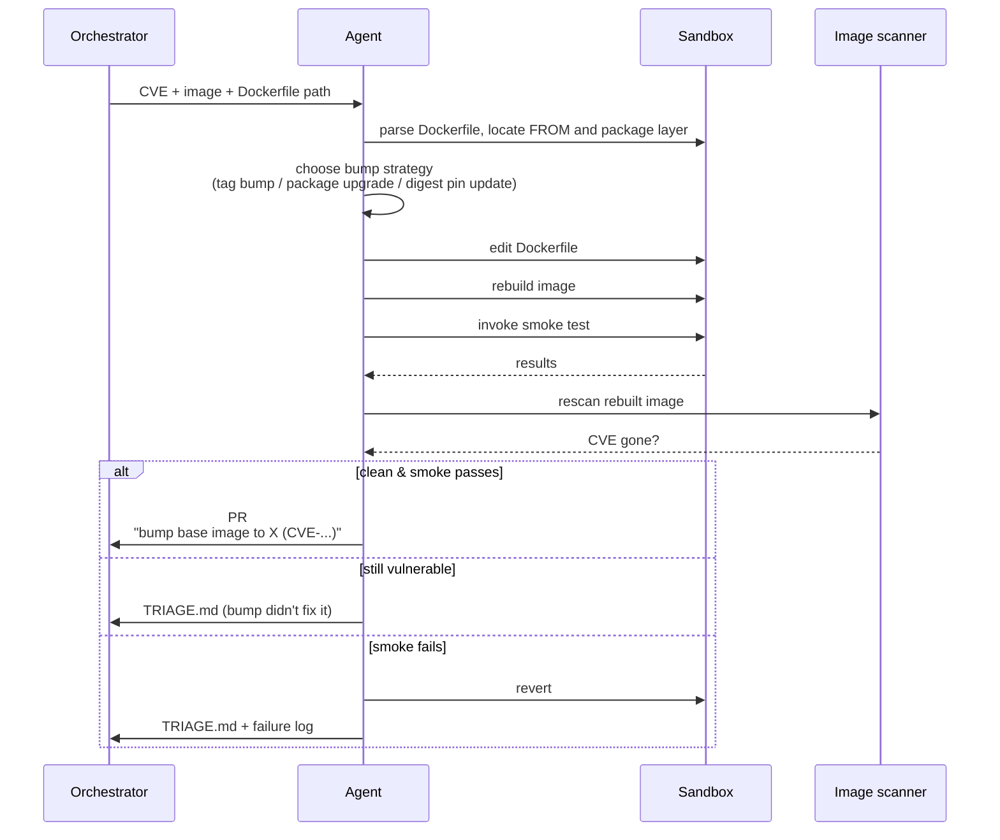


**Scope.** OS-level packages and the **base image lineage** —
`FROM` lines, `apt`/`apk`/`dnf` package lists, `RUN apt-get
upgrade` patterns, distroless image tags, and the multi-stage
chain that derives from them. Application dependencies (npm, pip,
Go modules) are handled separately under
[Vulnerable Dependency Remediation]().


## What problem this solves

Container CVE queues are dominated by two categories that look
similar in a scanner UI but have very different fix shapes:

- **Application-dependency CVEs.** A vulnerable npm or pip
  package — the lockfile workflow handles these.
- **Base-image / OS-package CVEs.** A vulnerable `glibc`,
  `openssl`, `curl`, or `zlib` shipped *inside the base image*.
  The fix is not in any lockfile; it's in the `FROM` tag (or in
  the package install layer below the application).

The second category is usually the larger queue, and historically
the slower one to drain — bumping a base image touches every
derived image in the lineage, the registry digest changes, and
the deployment manifests need to follow. The work is mechanical
once the policy is settled, but the policy is what stalls
adoption: which base image is the canonical one? When does a
patch tag (`3.19.1` → `3.19.2`) get auto-applied versus held for
review? What about distroless? What about images where the team
that owns the `FROM` line is different from the team that owns
the running service?

This workflow doesn't decide policy — it executes a policy the
program has already declared, opens PRs against the affected
Dockerfiles and manifests, and stops cleanly when the change
escapes its blast radius.

## High-level flow

## What 'eligible' means

- The CVE is present in the **base image** or in a layer the
  Dockerfile creates with a package manager (`apt`, `apk`, `dnf`,
  `microdnf`, `yum`, `zypper`).
- A patched version exists either as a **new base-image tag**
  (`3.19.1` → `3.19.2`) or as a **package upgrade** the package
  manager can apply at build time.
- The bump is on the **policy-approved curve** — typically:
  patch-version base-image bumps and package upgrades are
  auto-eligible; minor-version bumps require human review;
  major-version bumps always require human review.
- The repo owns the affected Dockerfile (CODEOWNERS resolves
  cleanly).
- The repo's CI builds the image and runs at least a **smoke
  test** the agent can invoke — `image starts → /health returns
  200`, or the equivalent. No smoke test, no auto-bump.

Anything else routes to the triage queue.

## What 'multi-layer' really means here

Three different shapes of "image" all need explicit policy:

- **Single-stage application image.** One `FROM`, one app. The
  agent edits the `FROM` line (or the package list) and rebuilds.
- **Multi-stage build with a build-stage and a runtime-stage.**
  The agent typically bumps both `FROM` lines together unless the
  build stage is intentionally pinned to a different distro
  (e.g., a heavy build-tools image, a distroless runtime). The
  agent must respect that pin and only bump the matching family.
- **Layered / derived images** — your org publishes a curated
  base image (`internal/python-base:3.12`), and a hundred
  application images derive from it. **Two different remediation
  shapes apply here**, and both belong to this workflow:
  - **Base-image bump.** A separate workflow / repo owns the
    curated base image; bumping it is the upstream fix and is
    a single PR against that one repo.
  - **Derived-image refresh.** Once the curated base ships a new
    digest, every downstream image needs to rebuild against it.
    Some teams pin the `FROM` to a moving tag and pick the
    rebuild up automatically; others pin to a digest and need a
    PR per derived repo. The agent handles the per-repo case
    *only when the policy says it should* — otherwise this is a
    rebuild-trigger problem, not a code-edit problem.

The classifier reads the `.sec-auto-remediation.yml` to know
which shape applies to the repo it's looking at.

## What the agent does

## Bump strategies the agent picks from

The agent has a small, named set of edits. Each Dockerfile
finding maps to exactly one:

- **Tag bump.** Edit the `FROM` line to a newer patch tag.
  Pre-condition: the new tag exists in the registry and the
  registry advisory says the CVE is fixed at that tag. Post-edit:
  rebuild, rescan, smoke.
- **Digest pin update.** When the repo pins to a digest
  (`FROM image@sha256:…`), edit the digest to the registry's
  current tag-resolved digest for the same logical version. Same
  pre/post conditions.
- **Package upgrade.** Edit the `RUN apt-get install` /
  `RUN apk add` line to either pin the patched version or add an
  explicit `apt-get upgrade <pkg>` step before the install. The
  agent prefers pinning to upgrading-without-pin — pinning is
  reproducible.
- **Curated base bump (separate repo).** When the repo's
  Dockerfile derives from an internal curated image, the bump
  shape is a one-line edit to the `FROM` tag *plus* a comment
  in the PR body linking to the upstream curated-image PR (or
  the digest the curated base now resolves to, when the curated
  base uses a moving tag).
- **Distroless rebase.** Switching from a full distro to a
  distroless variant is **not** an auto-eligible shape. The
  agent flags candidates in triage; humans drive the rebase.

Anything that requires a multi-stage refactor, a new package
manager, or an OS family change is out of scope.

## Rebuild & redeploy semantics

The PR is the agent's last step. Everything after the merge is
the existing CI/CD pipeline's job — but the agent's PR body has
to make the post-merge picture explicit:

- **Affected images** — the registry paths that will rebuild.
- **Affected services** — the deploy manifests / Helm values /
  Kustomize overlays that pin to those images.
- **Rollout shape** — does this go through canary, blue/green,
  or a straight rolling update?
- **Rollback plan** — the previous tag/digest, ready to paste
  into a revert.

This is reviewer information; the agent does not trigger
deploys. A human reviewer is the gate between "PR merged" and
"prod restarted."

## Guardrails

- **One image, one PR.** Even when a single CVE affects ten
  derived images, each gets its own PR. Reviewers need diffs they
  can reason about in isolation, and a regression in one
  shouldn't block the other nine.
- **Rescan required.** Before opening the PR, the agent rebuilds
  and re-runs the image scanner against the new image. The
  original CVE must be gone *and* the total CVE count must not
  have increased. New CVEs introduced by the bump are a
  reviewer-needs-to-know event, not silent.
- **Smoke test required.** No image without a startup-and-health
  check is eligible. "It built" is not "it works."
- **Layer cache is not a fix.** A registry-cached layer hiding a
  vulnerable package is not remediation. The agent rebuilds with
  `--no-cache` for the affected layer (or the whole image, when
  the cache state is uncertain).
- **No `latest` tags.** The agent will not introduce a `latest`,
  a moving major-version tag (`python:3`), or a missing tag. If
  the existing Dockerfile uses one, the agent flags it in the
  triage queue and does not silently pin "while it's at it."
- **Registry credentials are scoped.** The agent uses a build-time
  token that can pull from the org's registries and **cannot
  push**. Push happens from CI under the existing pipeline
  identity.
- **Human approval required.** Standard auto-remediation label;
  a reviewer from the security team and a reviewer from the
  service-owning team approve before merge. For curated base
  images, the platform team is also a required reviewer.

## What it won't catch

- **CVEs in the kernel or in the host runtime.** Container
  remediation can't fix what the host kernel does. Those go
  through the platform team's patching workflow.
- **CVEs in private / vendored bases** the orchestrator can't
  pull or scan.
- **Images built outside the repo.** If the image is built by an
  external pipeline, the agent has no Dockerfile to edit.
- **Application packages that *also* appear in the base image.**
  When a CVE applies to both a base-image library and a
  language-runtime install (e.g., a `libssl` linked into a Python
  wheel), both workflows need to coordinate. The agent does not
  drive that coordination — it stops and triages.
- **Reproducibility regressions.** A bump that builds today but
  is irreproducible tomorrow (because of a moving upstream)
  passes CI but fails the rebuild-on-redeploy invariant. The
  smoke test won't catch this; an explicit reproducibility
  check (rebuild from clean cache twice, compare digests) is the
  reviewer's job.

## How this workflow evolves

- **Policy file.** The list of allowed base images, the curve
  of "auto / review / human" by bump magnitude, and the
  ownership rules live in a versioned policy file. Changes to
  the policy go through the same review process as a new
  workflow.
- **Curated bases.** As the platform team curates more bases,
  the auto-eligible surface grows. As distroless adoption rises,
  the package-upgrade shape becomes less common and the digest-pin
  shape more so.
- **Scanner.** New image scanners (Trivy, Grype, Snyk Container,
  vendor-internal) plug in via MCP. The classifier consumes
  structured findings; the agent doesn't know which scanner
  produced them.

## See also

- [Vulnerable Dependency Remediation]()
  — the lockfile-shaped sibling workflow.
- [Artifact Cache & Mirror Quarantine]()
  — the workflow that runs when a base image's *publisher* is
  compromised.
- [Reviewer Playbook]()
  — what a reviewer looks for in a base-image PR.

## Changelog

- 2026-04-25 — v1 reference workflow. Patch-tag bumps, package
  upgrades, and digest-pin updates auto-eligible. Distroless
  rebases, OS-family changes, and curated-base creation remain
  human-driven.
