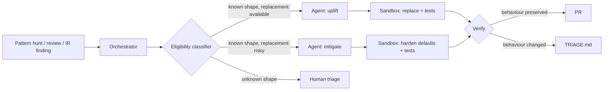


**Why this section exists.** Some weaknesses are not bugs in a
released version — they are *defaults* in widely used
libraries. Pickle is unsafe by design; PyYAML's `load()` was
unsafe-by-default for a decade; Java's `ObjectInputStream` will
deserialize anything you point it at; JWT libraries used to
accept `alg: none` because the spec said so. None of these are
patched in the conventional sense. They get fixed by *changing
the call*. This section is the catalogue of those changes.


## What this is — and isn't

This is **not** a CVE workflow. It is **not** a SAST workflow.
The findings here typically aren't surfaced by either: there is
no advisory ("`yaml.load()` was always unsafe"), and a SAST
scanner often won't fire either, because the call site looks
correct against the API surface. They are surfaced by:

- Manual review of new repos (a security partner reading the
  imports).
- Org-wide "pattern hunts" — periodic searches for the call
  shape across every repo.
- Migrations to a hardened framework or a new language version.
- Incident-response findings ("we read the code, this is how
  the breach happened").

The remediation has two flavours: **mitigation** (work around
the unsafe default without removing the call) and **uplift**
(replace the call with a safer construct). Both are durable and
worth catalogueing because the same weaknesses show up year
after year, in new code, in repos nobody flagged.

## High-level flow

## What 'eligible' means

A finding is eligible when:

- The pattern matches one of the recipes catalogued under
  [Classic Vulnerable Defaults]().
- The data flowing into the unsafe call is **untrusted** in at
  least some real call path. (A pickled file generated *and*
  consumed entirely on the same trusted host is a different
  conversation — the agent flags it but doesn't auto-fix.)
- The replacement (uplift) or hardening (mitigation) is in the
  recipe's catalogued shape. No invented shapes.
- A test exists or can be authored that round-trips an example
  payload and asserts behaviour.

## Mitigate vs. uplift — when to pick which

The recipes give a default; the workflow can override based on
the repo's policy.

- **Uplift** is preferred when:
  - The replacement is well-supported in the language /
    framework version the repo runs on.
  - The data round-tripped through the unsafe call is not on a
    persistence path that older systems still need to read.
  - The repo's tests cover the call path well enough to detect
    a behavioural regression.
- **Mitigate** is preferred when:
  - The unsafe call is on a backwards-compatibility path (old
    pickled checkpoint files, legacy XML docs from partners).
  - The replacement would force a coordinated, multi-repo
    migration.
  - The repo has thin test coverage on the call path.
- **Always do both** when feasible — uplift for new code,
  mitigate for the old read-path. The PR is bigger, but the
  end-state is correct.

## Catalogue of recipes

The full prompts live in the prompt library. The
[Classic Vulnerable Defaults]()
hub catalogues each one; the per-recipe pages have the agent
prompts.

Headline patterns this section currently covers:

- **Python pickle / cPickle / dill on untrusted input.** Uplift:
  JSON, msgpack, protobuf, or a restricted-unpickler subclass.
  Mitigate: monkey-patch the module to wrap calls and
  log-and-reject any tagged payload.
- **PyYAML `yaml.load()` without `Loader=`.** Uplift: replace
  with `yaml.safe_load()`. Mitigate: monkey-patch `yaml.load` at
  import time to default the loader.
- **Java `ObjectInputStream`.** Uplift: replace with a JSON
  serializer (Jackson with default-typing disabled, Gson with
  type adapters). Mitigate: install JEP 290 deserialization
  filters with a strict allowlist.
- **PHP `unserialize()` on untrusted input.** Uplift: replace
  with `json_decode()`. Mitigate: pass `allowed_classes => []`
  to refuse object reconstruction.
- **.NET `BinaryFormatter` / `NetDataContractSerializer`.**
  Uplift: replace with `System.Text.Json` or
  `DataContractSerializer` constrained to `KnownTypes`.
  Mitigate: enable the .NET 5+ disablement flag and surface
  remaining call sites.
- **Jackson polymorphic deserialization.** Uplift / mitigate:
  disable default typing, replace with `@JsonTypeInfo`
  allowlist; if the codebase relies on default typing, install
  a `BasicPolymorphicTypeValidator` with an explicit allowlist.
- **JavaScript `eval()` / `new Function()` on untrusted input.**
  Uplift: replace with `JSON.parse` or a restricted
  expression evaluator with an opcode allowlist. Mitigate: add
  a CSP header banning `unsafe-eval`.
- **XML external entities (XXE) defaults.** Uplift: switch
  Python `xml.etree` / `lxml` to `defusedxml`; for Java,
  configure `XMLInputFactory` with external-entity
  disablement; for PHP, `libxml_disable_entity_loader(true)`.
- **JWT `alg: none` and algorithm confusion.** Uplift: pass an
  explicit algorithm allowlist to every `verify()` call.
  Mitigate: monkey-patch the library to reject `alg=none` at
  the import boundary.
- **Log4j-shape lookups (any logger that interpolates).**
  Mitigate: pin upgraded version, set
  `formatMsgNoLookups=true`, remove `JndiLookup.class` from the
  classpath. Uplift: switch to a logger without lookup
  interpolation by default.
- **`requests.verify=False` / disabled cert verification in
  HTTP clients.** Uplift: configure the proper CA bundle.
  Mitigate: monkey-patch the client to fail-closed when
  `verify=False` is requested in non-test environments.
- **Prototype pollution defaults (`Object.assign`, recursive
  `merge`).** Uplift: use `Object.create(null)`, freeze
  prototypes, use a vetted merge library that filters
  `__proto__` / `constructor` / `prototype` keys. Mitigate:
  add a global key-filter shim at module load.
- **Permissive CORS `Access-Control-Allow-Origin: *` with
  credentials.** Uplift: replace with an explicit allowlist;
  reject credentialed wildcard. Mitigate: add a middleware that
  rejects credentialed wildcard responses at egress.
- **Cookies missing `Secure` / `HttpOnly` / `SameSite`.**
  Uplift: change the framework's default cookie config.
  Mitigate: add a response middleware that rewrites cookie
  attributes on egress.

This catalogue grows. New entries land via the same review
process as a new prompt — two reviewers, a sample diff, a test
template, and a regression-set entry.

## Guardrails

- **Behaviour preservation is the test.** Every recipe ships a
  test template that round-trips a representative payload
  through the old and new call sites and asserts the *behaviour*
  matches. A recipe without that test does not deploy.
- **Backwards-compat read-paths.** When the recipe's uplift
  removes ability to read old data, the PR adds a clearly
  marked "legacy read" path, kept until a documented
  migration is done. The agent does not silently strand old
  data.
- **No silent broadening.** Mitigations like JEP 290 filters
  and Jackson allowlists are *narrow*. A reviewer who later
  loosens them must see the loosening as a separate, reviewable
  PR — never as a diff hidden inside an unrelated change.
- **Audit the dropped behaviour.** When a mitigation rejects a
  payload (`alg=none` JWT, pickled object with disallowed
  class, XML with external entity), it logs the rejection.
  Silent drops hide the attack and the false positive
  equally.

## What this section is not

- An exhaustive list. There are dozens of these patterns; the
  catalogue covers the highest-impact, most durable ones and
  grows as new submissions land.
- A substitute for static analysis. The recipes pair well with
  Semgrep / CodeQL rules that surface call sites; the rules are
  the hunt, the recipes are the fix.
- Free-form refactoring. Recipes are bounded to the unsafe
  call and its immediate surroundings. "While you're in there"
  is how a small fix becomes an unreviewable change.

## See also

- [Classic Vulnerable Defaults — recipes]()
  — the per-pattern agent prompts.
- [SAST Finding Remediation]()
  — when the same patterns are found by a scanner.
- [OWASP Top 10 (2026) — remediate]()
  — when one of these patterns maps to an OWASP category.
