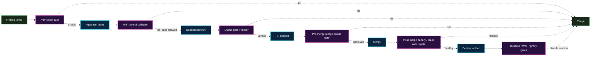


**Why this page exists.** "Reviewer-gated" is a slogan, not a
design. Once a program runs more than one workflow, "the
reviewer" is no longer the only gate — there are gates before
the agent runs, gates while it's running, gates before its PR
merges, gates after the PR merges, and gates the runtime imposes
regardless of what any of the previous gates allowed. This page
catalogues the flavours, where each one fits, and what each
buys you that the others don't.


## How to read this page

A *gate* is a deterministic checkpoint that can refuse, modify,
or escalate an agent action. Every gate has four properties:

- **Where it sits** in the lifecycle — admission, mid-run,
  pre-merge, post-merge, runtime, cross-cutting.
- **What it inspects** — intent, tool call, diff, policy,
  telemetry, identity.
- **What it can do** — allow, deny, modify, hold-for-review,
  ratchet-down-permissions, kill the session.
- **What it costs** — latency, reviewer load, false-positive
  rate, integration surface.

A robust program does **not** pick one gate. It picks a stack —
maybe four or five gates from across the lifecycle, layered so
that any one failure is contained by the next gate downstream.
Defence-in-depth is the design; gatekeeping is the vocabulary.

## The lifecycle

## 1. Admission gates — "should this run at all?"

Admission gates sit *before* the agent starts. They inspect the
intake (advisory, finding, ticket) and decide whether the
workflow is allowed to dispatch.

- **Eligibility classifier.** The deterministic rules from the
  per-workflow page (file extension allowlist, advisory shape,
  CODEOWNERS resolves, opt-in marker present). Cheap, fast,
  refuses the most cases.
- **Quota / rate gate.** Per-repo, per-workflow, per-org caps
  on open agent PRs. A workflow that would push the queue past
  the cap holds the run; the dispatcher tries again later. This
  gate is what keeps the reviewer queue from becoming a
  firehose.
- **Cost gate.** A budget cap on token spend per finding-class
  per day. When the budget is hit, the workflow auto-pauses.
  This is the same control as the
  [Emerging Patterns task budget]()
  but applied at the dispatcher rather than the model.
- **Identity / role gate.** The dispatcher refuses to run
  unless the calling principal has the workflow's required
  role. Kept separate from the agent's runtime identity so
  privilege confusion is impossible at this layer.
- **Maturity-stage gate.** A workflow that has not exited its
  pilot stage is not eligible to run on a repo outside the
  pilot set. See
  [Rollout & Maturity Model]().
- **Change-freeze / blackout gate.** A calendar-aware refusal
  during code freezes, on-call rotations under elevated alert,
  or named release windows. Cheap to add; pays for itself the
  first time it prevents a midnight bump during a launch.

## 2. Mid-run tool-call gates — "is this specific call allowed?"

Mid-run gates sit between the agent and any tool it tries to
invoke. The agent **proposes**; the gate **disposes**.

- **Static tool allowlist.** The flat list of tools the workflow
  is allowed to call. The orchestration framework enforces it;
  the agent cannot expand it at runtime.
- **Per-call argument validators.** Beyond "may call
  `git_push`," the gate inspects the *arguments* — branch name
  matches the workflow's branch convention, target repo is on
  the allowlist, target file paths are in the workflow's scope.
- **Capability tokens / scoped credentials.** Each tool runs
  under a credential scoped to the smallest privilege that
  works. A `git_push` token that can only push to
  `remediate/*` branches refuses everything else as a property
  of the credential, not as a property of the agent's behaviour.
- **Inline policy engine.** A general-purpose policy engine
  (OPA, Cedar, an in-house equivalent) evaluating the proposed
  call against a declarative policy. Useful when the rules are
  cross-cutting ("no tool may modify a `db/migrations/` file").
  See [Runtime Controls]()
  for the per-tool-call proxy that implements this in practice.
- **Elicitation / human-in-the-loop gate.** A tool call that
  matches a "needs human" rule pauses and surfaces a structured
  question to the operator. The agent does not proceed without
  a typed answer. See
  [Emerging Patterns → Elicitation]()
  for the protocol-level shape.

## 3. Output gates — "is what the agent produced acceptable?"

Output gates sit between the agent's draft work and the rest of
the world. They run on the *artefact* (the diff, the triage
note, the audit record), not on the in-progress run.

- **Verifier re-run.** The same scanner that produced the
  finding re-runs against the patched sandbox. The original
  finding must be gone *and* no new finding may have appeared.
  This is the load-bearing output gate for SDE, SAST, and
  base-image workflows.
- **Diff-shape validator.** A deterministic check that the diff
  matches the shape the workflow allows: only files on the
  allowlist, line count below the cap, no edits to forbidden
  regions (CI, secrets, migrations).
- **Test gate.** The workflow's test target passes; the new
  test (when the workflow requires one) fails against the old
  code and passes against the new code. No test, no PR.
- **PR-body schema gate.** The PR body matches a structured
  schema — finding ID, fix shape applied, blast radius, rollback
  plan, follow-up checklist. PRs that don't validate against the
  schema don't open.
- **Triage-note schema gate.** Triage notes have a schema too.
  An unstructured "the agent gave up" message is itself a
  failure mode worth catching.

## 4. Pre-merge merge-queue gates — "even if reviewed, should this merge now?"

Pre-merge gates sit between PR approval and merge. They protect
the merge from external state the reviewer didn't model.

- **Reviewer pool gate.** The PR has reviews from the workflow's
  required reviewer pools — one from security, one from the
  owning team — and the reviewers are independent of the agent's
  operator.
- **Two-key gate.** For high-blast-radius workflows (artifact
  cache purge, base-image bump on a curated base), require two
  approvals from named roles, not just any reviewer.
- **Merge-queue freshness gate.** The PR is rebased on the
  current base branch and CI is green against the rebased
  state. Stale merges that pass against an old base are a
  surprisingly common regression vector.
- **Cross-PR dependency gate.** When two agent PRs touch the
  same lockfile, the gate enforces a serialisation — second PR
  rebases against the merged first PR before merging. Bundling
  is a separate guardrail; this gate is what enforces serial
  execution.
- **Signed-PR gate.** The PR's HEAD commit is signed by the
  agent's identity, not by a developer's identity. Useful when
  audit needs to distinguish "human wrote this" from "agent
  wrote this" without trusting the PR-body label.

## 5. Post-merge gates — "what happens after merge but before full deployment?"

Post-merge gates are the last chance to catch something before
the change reaches every user.

- **Canary / progressive rollout.** The change deploys to a
  small percentage of fleet first; an SLO monitor decides
  whether to promote.
- **Blast-radius classifier.** A separate model (often a
  smaller, deterministic model) classifies the change as
  low / medium / high blast radius based on the diff and routes
  the rollout shape accordingly. Low-risk changes auto-promote
  faster; high-risk changes hold longer.
- **Auto-rollback monitor.** A short window post-deploy where
  any error-rate or latency-SLO breach triggers an automatic
  revert. The monitor doesn't know it's watching an agent's
  change; it watches every deploy. That's the right design.
- **Forensic ledger entry.** Every merged agent PR appends an
  entry to an append-only ledger (the change, the agent's run
  ID, the reviewer, the rollout state). The ledger is read-only
  to the agent.

## 6. Runtime / proxy / WAF gates — "what does production see?"

Runtime gates sit in the request path, not in the change-control
path. They constrain *behaviour* of running code, not the act
of changing it.

- **Inline action proxy.** Every agent's tool calls go through
  a proxy that observes, classifies, and (when policy says so)
  blocks or holds. See
  [Runtime Controls]().
- **Telemetry-driven session disablement.** A monitor watching
  agent telemetry decides to **kill** an in-flight session when
  the telemetry deviates — exfiltration patterns, scope creep,
  budget anomalies, prompt drift. Same page.
- **Application-layer WAF rules.** When the remediation is a
  runtime mitigation rather than a code change (rate-limit a
  vulnerable endpoint, block an exploit pattern), the WAF rule
  is the gate. The agent can author the rule but does not
  deploy it.
- **Egress allowlist on the agent's own network.** The agent's
  sandbox can only reach a named set of hostnames. Useful when
  the agent's own data-exfiltration risk is part of the threat
  model.

## 7. Cross-cutting gates — "rules that apply at every layer"

Some gates aren't a layer; they cut across all of them.

- **Audit-log gate.** Every gate decision (allow / deny /
  modify) is logged with the rule that fired, the input, and
  the outcome. A workflow with a non-loggable gate is itself a
  failure mode.
- **Feature-flag gate.** Every workflow runs behind a flag.
  Killing the flag halts the workflow at every layer
  simultaneously. The flag is the operator's emergency stop.
- **Time-window gate.** Some workflows are only allowed to
  *act* during business hours, even if they're allowed to *run*
  any time. Useful when the post-merge rollback path needs a
  human present.
- **Provenance gate.** The agent's identity, model version,
  prompt version, and tool catalog hash are recorded on every
  action. A change to any of those is itself a reviewable
  event.
- **Kill-switch.** A single point of control that disables the
  agent globally. Should be reachable from both the security
  team and the engineering platform team. Test it monthly.

## How to pick a stack

A workflow does not need every gate. The sensible defaults:

- **Routine workflows** (lockfile bumps, SDE redaction):
  Admission classifier + tool allowlist + scanner re-verify +
  reviewer-pool merge gate + post-merge canary + audit log.
- **High-blast-radius workflows** (artifact cache purge,
  curated-base bump, anything that touches infra):
  Add a two-key merge gate, add an inline action proxy, add a
  time-window gate, add a feature flag.
- **Experimental / pilot workflows:** Add elicitation at every
  tool call, halve the quota gate, add a cost cap, scope the
  reviewer pool to the pilot team.

The pattern is the same: pick a gate at *each* lifecycle stage,
not just one stage. A program with five gates at the merge step
and zero gates at the runtime step is not defended in depth; it
is defended in one layer.

## What this page is not

- A vendor selection. Every gate above has half a dozen
  off-the-shelf implementations and several reasonable
  in-house ones. The shape is the contribution; the product
  choice is yours.
- A "more is better" argument. Every gate adds latency,
  integration surface, and operational load. The right number
  is the smallest stack that catches the failure modes you've
  actually seen — and one extra for the failure mode you fear
  most but haven't seen yet.
- A substitute for a reviewer. Gates filter what the reviewer
  sees; they do not replace the reviewer. The
  [Reviewer Playbook]()
  is what the reviewer reads after the gates have done their
  filtering.

## See also

- [Reviewer Playbook]()
  — what the human at the merge gate looks for.
- [Runtime Controls]()
  — the proxy and telemetry-driven gates in detail.
- [Rollout & Maturity Model]()
  — which gates are required at which adoption stage.
- [Emerging Patterns → Task budgets]()
  — the cost-gate primitive at the model layer.
- [Threat Model]()
  — the failure modes the gates are defending against.
