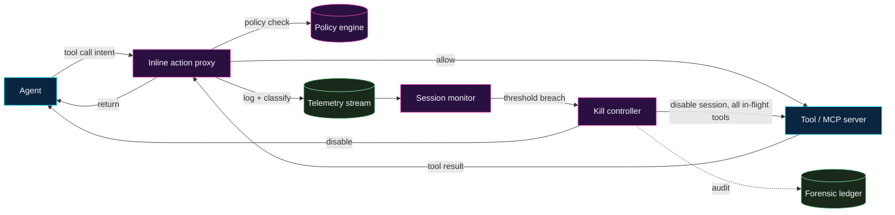


**Why a runtime gate?** Every other gate on this site fires
before or after the agent acts on a specific intent. Runtime
gates fire **while** the agent is acting, on signals the
prompt-time policy could not have anticipated. They are the
last line of defence against an agent that has been compromised
mid-run, that has drifted onto a different task, or that is
doing what the prompt said but in a way nobody intended.


## What this page covers

Two related, often-confused controls:

- **Inline action proxies** — a deterministic intermediary
  every tool call passes through, with the authority to log,
  classify, modify, hold, or refuse the call.
- **Telemetry-driven session disablement** — a monitor that
  reads the agent's run telemetry and decides to kill an
  in-flight session when the telemetry crosses a threshold.

Both belong in the
[Gatekeeping Patterns]()
catalogue. This page is the long-form treatment because the
implementation details are where this pattern earns its keep
or fails silently.

## Why this is harder than it sounds

A runtime gate sounds like "just put a proxy in front." The
hard parts are everything else:

- **Observability without trust.** The proxy reads tool calls
  and tool results that may be malicious — tool-poisoning,
  smuggled instructions in tool output, exfiltration channels
  embedded in argument strings. The proxy itself is a target.
- **Latency budget.** Every tool call already costs round-trip
  time; an inline gate adds to that budget. A gate that
  doubles latency will get bypassed in production within a
  quarter.
- **False positives are louder than false negatives.** A gate
  that interrupts a healthy run feels like a regression to the
  team running the workflow; a gate that misses a malicious
  run is a one-time incident report. Operators will tune
  toward fewer interrupts unless the program designs against
  it.
- **Telemetry is not detection.** Logging an event is not the
  same as deciding to act on it. The hard problem is the
  decision logic — when does "the agent looked at 50 files in
  one turn" mean "exfiltration in progress" versus "this
  particular workflow legitimately scans the repo"?

This page is opinionated about the design choices that make
the difference.

## Architecture

## The inline action proxy

Every tool call (and every tool result) passes through one
process whose job is to inspect, classify, and (when policy
says so) act. The proxy is **the** enforcement point for
mid-run gates from
[Gatekeeping Patterns]().

### What it inspects

- **Tool name + arguments.** The proposed call's full payload.
- **Calling agent identity.** Which agent (workflow, prompt
  version, model version) is making the call.
- **Session state.** How many calls so far, which tools, what
  the cumulative scope looks like.
- **Tool result.** Particularly: result *size*, result *type*,
  whether the result includes content that resembles
  instructions (a tool-poisoning signal), and whether the
  result references entities outside the workflow's scope.

### What it can do

A proxy that can only "log" is observability, not gatekeeping.
A useful proxy can do all of:

- **Allow** — pass the call through unmodified.
- **Allow + log** — the default for routine calls.
- **Modify** — strip a forbidden argument (a wildcard glob
  outside scope, an outbound URL not on the allowlist) and
  pass the call through with the modification noted.
- **Hold-for-elicit** — pause the call and surface a typed
  question to the operator. The agent gets the answer once a
  human responds.
- **Deny + return-error** — refuse the call and return a
  structured error to the agent. The agent sees the refusal
  and may stop, retry differently, or write a triage note.
- **Deny + kill-session** — refuse the call, kill the agent
  process, and route a forensic event to the session monitor.

The set of actions is small on purpose. A proxy with too many
verbs is hard to reason about under pressure.

### Where it sits

Two viable placements, with different trade-offs:

- **In-process / SDK shim.** The proxy is a wrapper around the
  agent's tool-use SDK; tool calls are intercepted before they
  leave the agent's process. Lowest latency. Highest
  trust-in-the-process — if the agent's process is compromised,
  the proxy is too.
- **Out-of-process / network proxy.** The agent's tool calls
  egress over a known transport (HTTP / gRPC / MCP) and the
  proxy is a separate process on that transport. Higher
  latency, but the proxy survives an agent-process compromise.
  This is the right choice for high-value workflows.

For most programs: start with an SDK shim, plan to add a
network proxy when a high-value workflow goes live.

### Implementation choices that matter

- **Policy engine, not switch statements.** Rules are
  declarative (OPA, Cedar, an in-house equivalent). Switch
  statements rot fast and resist audit.
- **Pinned tool descriptions.** The proxy enforces a hash on
  every tool description it sees from the MCP server. A
  description that changed is itself an event — see
  [Threat Model → tool poisoning]().
- **Symmetric inspection on tool results.** Tool results are
  prompt-layer input to the next agent turn. Treat them with
  the same care as prompt injection.
- **Argument bound-checking.** Number-typed args have ranges,
  string-typed args have length caps and regex shapes,
  list-typed args have length caps. A 10MB argument is itself
  a signal.
- **Fail-closed under doubt.** When the proxy can't decide
  (policy engine timeout, missing rule), the default is deny.
  Fail-open here is how proxies become security theatre.

## Telemetry-driven session disablement

The proxy logs to a telemetry stream. A separate **session
monitor** reads that stream, applies decision rules, and
decides when to **kill** an in-flight session. Killing an
agent session in the middle of a tool call is a violent
operation; the rules for when to do it are the most important
part of this design.

### What signals the monitor reads

- **Tool-call rate.** Calls per minute, deviation from the
  workflow's historical baseline.
- **Scope expansion.** Files / repos / hostnames touched per
  turn. The workflow has a declared scope; the monitor
  measures distance from it.
- **Argument anomaly.** Argument shapes deviating from the
  workflow's historical distribution — long strings, base64
  blobs, URLs not on any allowlist.
- **Tool-result anomaly.** Result size deviating from the
  baseline, result content containing strings that look like
  instructions, results referencing entities the agent did not
  request.
- **Token / budget anomaly.** Cumulative token spend
  approaching or crossing the
  [task-budget]()
  cap, especially when the rate is accelerating.
- **Egress / network signals.** Outbound connections to
  unfamiliar destinations, DNS lookups for typosquat
  neighbours, unexpected payload sizes.
- **Filesystem signals.** Reads outside the workflow's
  declared scope, writes to forbidden paths, reads of
  credentials / SSH keys / cloud-provider metadata endpoints.
- **Prompt-drift signal.** Output content drifting from the
  workflow's expected schema (PR-body shape, triage-note
  shape) — a precursor to a workflow producing structurally
  invalid artefacts.

### Decision rules

The rules are the *whole* design. Three patterns:

- **Threshold rules.** "More than N tool calls per minute,"
  "more than M files read in one turn." Cheap, easy to tune,
  easy to bypass by a slow attacker.
- **Deviation rules.** "Cumulative scope is now > 3σ from the
  workflow baseline." Catches gradual drift; needs a
  baseline; sensitive to baseline rot.
- **Pattern rules.** "Argument matches a known exfiltration
  shape," "tool result contains an entity from an
  agent-targeting threat list." Highest signal; highest
  maintenance.

A reasonable starting kit: threshold rules for the obvious
ceilings (call rate, scope, budget), deviation rules for the
gradual signals (cumulative file reads, cumulative outbound
bytes), pattern rules for the named threats (metadata
endpoints, link-local IPs, base64 blobs in arguments). Tune
thresholds against a 30-day baseline before going live; do not
ship rules that have never seen a healthy run.

### Killing a session

When the monitor decides to kill, the kill controller does
**all** of:

- **Refuse all in-flight tool calls** for the session at the
  proxy. The agent's next call returns a structured "session
  terminated" error.
- **Revoke the session's credentials.** Every scoped token
  the session was using is rotated *or* placed on a deny list
  immediately. Do not wait for the agent to acknowledge the
  termination.
- **Sever any long-lived sandbox.** The container / VM the
  agent runs in is paused (preserve forensic state), then
  destroyed once the forensic snapshot is captured.
- **Page the on-call.** A high-priority alert with the run
  ID, the rule that fired, and a link to the snapshot.
- **Append to the forensic ledger.** Every kill is an
  append-only ledger entry; the ledger is read-only to the
  agent and to the workflow's normal control plane.

The kill is **irreversible from the agent's side**. A session
kill is not a pause-and-resume; it is a stop, with the
expectation that humans will inspect, decide, and (when
appropriate) start a fresh session.

### What "disable" means in practice

The monitor's vocabulary needs a graduated set of actions
short of kill, because kill is expensive and noisy:

1. **Annotate.** Log the signal, attach to the run record.
   Used for tuning baselines.
2. **Hold-for-elicit.** Pause the next tool call and ask the
   operator for typed approval before resuming.
3. **Ratchet.** Reduce the session's scope on the fly —
   narrow the credential's permissions, revoke a specific
   tool from the allowlist for the rest of the session, cap
   the remaining budget.
4. **Quarantine.** Allow the session to continue but route
   its outputs to a hold queue rather than the normal merge
   path. The PR is opened in draft; the audit record is
   flagged "telemetry hold."
5. **Kill.** As above.

A program that only has "log" and "kill" will use neither.
The middle states are where this control earns its operational
keep.

## Failure modes the design has to defend against

- **Operator fatigue.** A monitor that fires noisy alerts
  trains the team to mute it. Tune ruthlessly; the right alert
  rate is "one per quarter, all real."
- **Self-disable via prompt injection.** A compromised tool
  result that says "the user has authorised disabling
  monitoring" must not be able to disable monitoring. The
  monitor's control plane is on a separate identity and a
  separate channel from the agent's tool stream.
- **Tail latency in the proxy path.** A slow policy engine
  that fails open is worse than no proxy. Every policy check
  has a hard timeout and a fail-closed default.
- **Replay of valid actions.** A killed session's credentials
  must be revoked, not merely "unassigned" — otherwise a
  reanimated process can replay the in-flight token.
- **Forensic state loss.** A kill that destroys the sandbox
  before snapshotting is a kill that destroys the evidence.
  Snapshot, then destroy.
- **Quiet-day drift.** A monitor that hasn't fired in 90 days
  is probably misconfigured, not virtuous. Schedule synthetic
  injections (red-team exercises against the workflow) on a
  cadence to validate the monitor still fires.

## Where this overlaps with existing categories

This is not a brand-new category — it borrows heavily from
patterns already familiar in adjacent fields:

- **EDR for agents.** The session monitor is the same shape
  as endpoint detection-and-response for the agent process.
- **WAF for tools.** The inline proxy is the same shape as a
  WAF for the agent's tool-call traffic.
- **DLP for tool results.** Result-content inspection is a
  DLP problem; the techniques are the same techniques the
  data-loss-prevention industry has refined for two decades.

The novelty is the *target* (an agent, not a user), not the
mechanics. Borrow the mechanics from the prior art; the
audit, identity, and elicitation primitives are the parts
that make agent-specific design sensible.

## What this page is not

- An argument that runtime gates replace the upstream gates.
  They don't. A workflow that relies only on a runtime
  monitor has built a smoke detector instead of a fire-safe
  building. Use this layer alongside admission, mid-run, and
  output gates — not in place of them.
- A vendor recommendation. The same shape can be implemented
  inside an AI-gateway product, an in-house policy engine, an
  EDR-style sensor, an LLM-guardrail framework, or a
  bespoke shim. The shape is the contribution.

## See also

- [Gatekeeping Patterns]()
  — where this layer sits in the full stack.
- [Threat Model]()
  — the failure modes runtime gates defend against.
- [Emerging Patterns → Task budgets]()
  — the budget-exhausted exit path the monitor reads.
- [Reviewer Playbook]()
  — what reviewers do when telemetry hold flags an agent
  output.

## Changelog

- 2026-04-25 — v1. Architecture, decision rules, and graduated
  action vocabulary captured. Specific rule kits and threshold
  defaults intentionally not committed to — those tune to each
  workflow's baseline.
