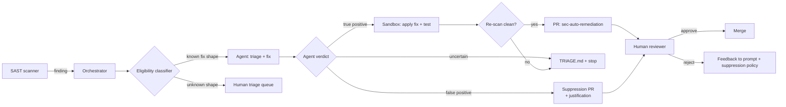
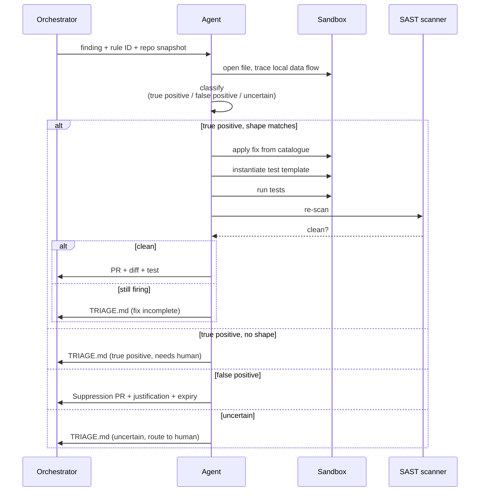


**Scope.** First-party code weaknesses surfaced by a deterministic
SAST scanner (Semgrep, CodeQL, SonarQube, Checkmarx, Snyk Code,
etc.). This is **not** a replacement for the scanner — the scanner
is still the source of truth — and it is **not** a free-form
"refactor this file." The agent only acts on a finding shape it
has been pre-authorised to touch.


## What problem this solves

SAST programs stall for two reasons. The first is the false-positive
rate — reviewers stop reading the queue once the signal-to-noise
ratio crosses a threshold, and after that nothing in the queue
moves. The second is the long tail of routine, mechanical fixes
(missing escaping on a template render, an `exec` that should be
`execFile`, a regex that should be anchored) that everyone agrees
on but no one schedules. Both are agentic-shaped: the triage step
is a constrained-judgement task with deterministic verification,
and the routine fix is a bounded edit with a test that would have
caught it.

This workflow runs *after* a deterministic scanner, never instead
of one. The scanner produces structured findings; the agent
decides what to do with each one inside a tight policy envelope.

## High-level flow

## What 'eligible' means

The classifier hands a finding to the agent only when **all** of
these hold:

- The finding's rule ID maps to a **named fix shape** in the
  workflow's policy file (see "Fix-shape catalog" below). The agent
  does not invent fix shapes.
- The affected file is on the repo's allowlist for SAST autofix
  (typically: source files, not generated code, not vendored
  libraries, not migrations).
- A test exists that exercises the affected code path, **or** the
  fix shape comes with a test template the agent can instantiate.
- The finding's data flow is **local** — confined to one function
  or one module. Cross-module taint flows go to human triage; the
  blast radius is too wide to fix without context the scanner
  doesn't have.
- The repo has a passing CI pipeline and an opt-in marker
  (`.sec-auto-remediation.yml`).

Anything else routes to the human triage queue, with the agent
optionally producing a triage note that pre-classifies the
finding (likely-true-positive / likely-false-positive / unsure)
to drain reviewer time without merging anything.

## Fix-shape catalog

The agent picks from a small, reviewed catalogue of fix shapes.
Each shape names the SAST rule families it applies to, the edit
pattern, and the test template that proves the fix works. New
shapes are added through the same review process as a new prompt:
two reviewers, a sample diff, and a regression set.

A representative starter catalogue:

- **Parameterise SQL.** Rule families: SQL injection. Edit:
  replace string concatenation / format-string with the driver's
  parameter binding. Test template: a unit test passing a payload
  with a single quote and asserting the query runs without
  injection.
- **Escape on render, not on input.** Rule families: stored / DOM
  XSS. Edit: move escaping to the template render point, remove
  pre-escaped storage. Test template: round-trip a payload
  containing `<script>` and assert it renders escaped.
- **`execFile` not `exec`.** Rule families: command injection.
  Edit: replace `child_process.exec` / `subprocess.run(shell=True)`
  with `execFile` / `subprocess.run(args=[...])` and an explicit
  argument allowlist. Test template: pass a payload containing
  `; rm -rf` and assert it is rejected, not executed.
- **Allowlist outbound URLs.** Rule families: SSRF. Edit: add a
  validator against an allowlist; resolve hostname once, connect
  to the resolved IP. Test template: assert a request to
  `169.254.169.254` is rejected.
- **Constant-time comparison for secrets.** Rule families: timing
  attacks on token compare. Edit: swap `==` for the language's
  constant-time comparator. Test template: assert the comparator
  is invoked.
- **Anchored regex.** Rule families: ReDoS / partial-match
  bypass. Edit: anchor the regex (`^…$`), constrain quantifiers,
  add a length cap. Test template: assert the cap rejects
  oversized input.
- **Disable XML external entities.** Rule families: XXE. Edit:
  configure the parser with external entities disabled. Test
  template: a payload referencing an external entity is rejected.

The catalogue is **the policy**. If a finding doesn't match a
shape in the catalogue, the agent does not fix it.

## False-positive handling

False-positive triage is the highest-leverage part of this
workflow — and the easiest to get wrong, because the cost of a
false negative (the agent says "false positive" on a real bug) is
far higher than the cost of a false positive (the agent kicks a
real false positive to a human).

The agent's posture, in order of preference:

1. **Default to true-positive.** If the agent is uncertain, the
   finding is treated as a true positive and either fixed (if the
   shape matches) or routed to triage.
2. **Suppression requires evidence.** A "false positive" verdict
   produces a **suppression PR**, not a merge — the PR adds an
   inline suppression comment with a one-paragraph justification,
   a link to the data flow the agent traced, and the rule ID. A
   reviewer still has to approve.
3. **Suppression has a half-life.** Every suppression carries an
   expiry date in its comment (default: 6 months). When the
   suppression expires, the finding re-fires and the agent (or a
   human) re-evaluates. Suppressions are not forever.
4. **Regression set.** A weekly job re-runs the agent against a
   hold-out set of known-true findings. If the agent
   misclassifies any of them, the workflow auto-pauses and pages
   the program owner. This is the single most important guardrail
   on the page; do not deploy this workflow without it.

## What the agent does

## Guardrails

- **Catalogue-only edits.** The agent will not invent a fix
  shape. If no shape matches, the finding goes to triage —
  even if the agent "knows" how to fix it.
- **One finding, one PR.** No bundling. A PR with two findings
  hides which fix caused a regression.
- **No taint-tracking outside the function.** If the data flow
  crosses a module boundary, the agent stops. Cross-module fixes
  routinely require API contract changes — out of scope.
- **Re-scan required.** Before opening the PR, the agent re-runs
  the scanner against the sandbox and confirms the original
  finding is gone *and* no new finding has appeared in the same
  file. If a new finding appears, the agent stops.
- **Suppression rate-limit.** If the suppression-PR rate exceeds
  the true-fix-PR rate over any 7-day window, the workflow
  auto-pauses. A scanner producing mostly false positives is a
  scanner-tuning problem, not an agent problem.
- **Human approval required.** Standard auto-remediation label
  and dual reviewer (security + owning team) before merge.

## What it won't catch

- **Logic bugs that look like security findings.** A SAST rule
  fires on syntactic patterns; some real bugs are deeper than
  the pattern. Cross-module flows, business-logic auth bugs,
  and timing-of-check-vs-use issues all need human eyes.
- **Findings whose fix is a redesign.** "Don't store this token
  unencrypted" is a redesign, not a fix-shape edit.
- **Cross-repo flows.** A taint that originates in one service
  and flows through a shared library into another is out of
  scope.
- **Vendored / generated code.** Fix the generator or upstream
  dependency, not the generated output.

## Per-scanner notes

The orchestration spine is scanner-agnostic — anything that
produces a structured finding with a stable rule ID can plug in.
A few practical notes:

- **Semgrep.** Rule IDs are stable and the rule body is YAML, so
  catalogue mapping is mechanical. Use `--sarif` output and the
  rule's `metadata.cwe` field as a secondary key.
- **CodeQL.** Query suite IDs are the right key, not the
  individual alert IDs. Map suite → fix shape, not query → fix
  shape.
- **SonarQube.** Rule keys are stable; severity is per-project
  configurable, so do **not** key eligibility on severity alone.
- **Snyk Code.** Issue IDs are stable; the data-flow graph is
  exposed and the agent should read it before classifying.
- **Vendor-mixing.** Two scanners flagging the same line is a
  strong true-positive signal. The classifier should weight
  cross-scanner agreement higher than single-scanner severity.

## How this workflow evolves

- **Catalogue.** New fix shapes are added when the same triage
  pattern shows up three weeks running. Each shape ships with a
  test template *and* a regression-set entry before it goes
  live.
- **Prompt.** Triage heuristics tighten as reviewers push back
  on suppression PRs. Track suppression-rejection rate as a
  prompt-drift signal.
- **Model.** Upgrade when the team's labelled finding set shows
  measurable precision improvement on the triage classifier —
  not when the model vendor ships a new version.
- **Tools.** New scanners plug in via MCP without changing the
  orchestration. The catalogue maps rule IDs to fix shapes;
  scanners produce rule IDs.

## See also

- [Reviewer Playbook]()
  — the seven-question checklist that gates these PRs.
- [Emerging Patterns → AI-assisted SAST triage]()
  — broader landscape this workflow sits inside.
- [OWASP Top 10 (2026) — remediate]()
  — when a SAST finding maps to an OWASP category, this prompt
  is the durable fix template.

## Changelog

- 2026-04-25 — v1 reference workflow. Starter catalogue covers
  injection, XSS, command-exec, SSRF, timing, ReDoS, and XXE.
  Cross-module flows, framework-mediated taint, and logic-bug
  classes remain human-only.
